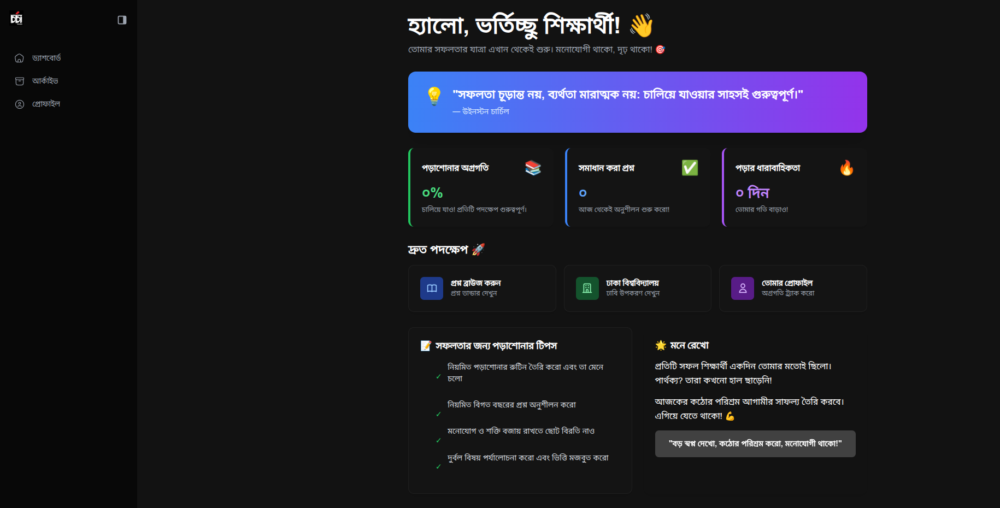

# 🎓 Chorcha.net Clone (Archive Page)

This project is a front-end clone of the "Archive" section from the popular Bangladeshi educational platform, **Chorcha.net**.

This project was created purely for learning and practice, aiming to replicate the design and functionality of a real-world website using fundamental web technologies.

## 🚀 Live Demo

You can view the live deployed version of this project here:

**[https://chorcha-clone-demo.onrender.com](https://chorcha-clone-demo.onrender.com)**

## 📸 Project Screenshot



## ✨ Features

* **Archive/Question Bank UI:** A clean interface for browsing and reading previous exam questions, mimicking the original Chorcha site.
* **Static & Lightweight:** Built with only vanilla HTML, CSS, and JavaScript. No frameworks or libraries.
* **Responsive Design:** The layout is designed to be usable on both desktop and mobile devices.
* **Focus on Fundamentals:** An exercise in semantic HTML, CSS styling, and basic DOM manipulation with JavaScript.

## 🛠️ Tech Stack

This project was built using:

* **HTML5**
* **CSS3** (Plain CSS, no preprocessors)
* **JavaScript (ES6+)**

## 🏁 How to Run Locally

Since this is a static website, no complex installation is required.

1.  **Clone the repository:**
    ```bash
    git clone https://github.com/Mirazraf/chorcha-remake.git
    ```
2.  **Navigate to the project folder:**
    ```bash
    cd chorcha-remake
    ```
3.  **Open the `dashboard.html` file:**
    Simply open the `dashboard.html` file in your favorite web browser (like Chrome, Firefox, or Edge) to view the project.

## 🎯 Purpose & Disclaimer

This project is a **clone** created for **educational purposes only**. It is a personal project to practice front-end development skills and is not affiliated with, endorsed by, or connected to the official **Chorcha (chorcha.net)** platform in any way. All original credit for the design and concept belongs to the Chorcha team.

## 👤 Developed By

* **Name:** Miraz Rafi
* **GitHub:** [@YourGitHubUsername](https://github.com/Mirazraf)

## ⚖️ License

This project is licensed under the MIT License. See the `LICENSE` file for details.